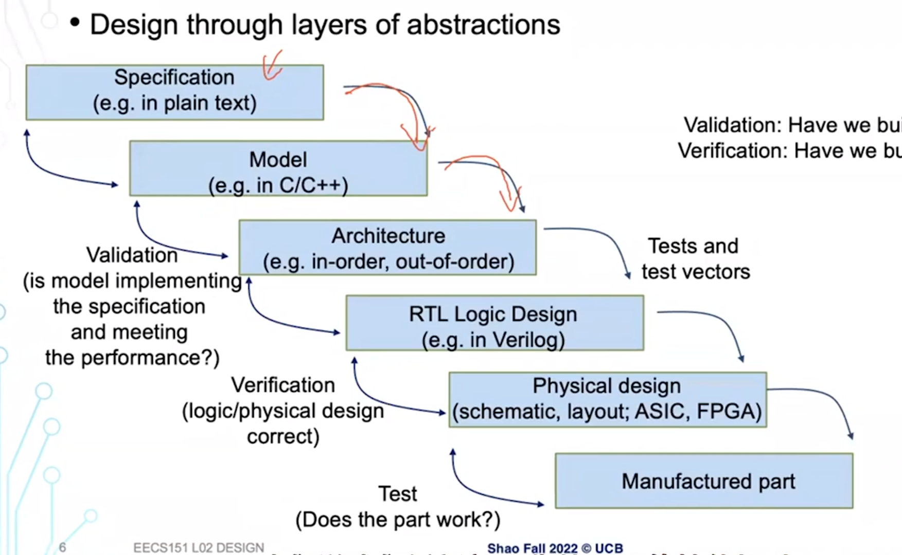
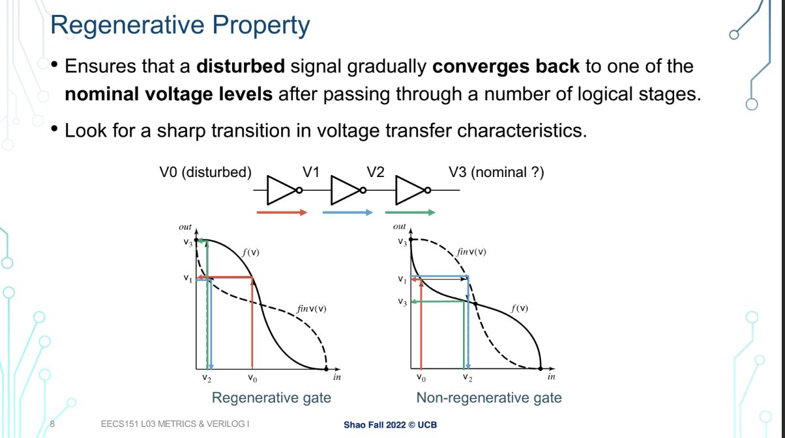

##### 层级划分 
 
##### 逻辑层次上的数字电路 
什么是所谓的高或者低电压？
 
高低电压存在一个**转换时间** 
#### METRIC
##### regenerative property 
 
就是说，在经过多个门后，原先不稳定的输入会逐渐稳定下来，而方法就是电压转换曲线的斜率选择，必须让中间输入递减或递增，查看二阶导数？ 
##### cost 
##### performance 
##### power and energy 
