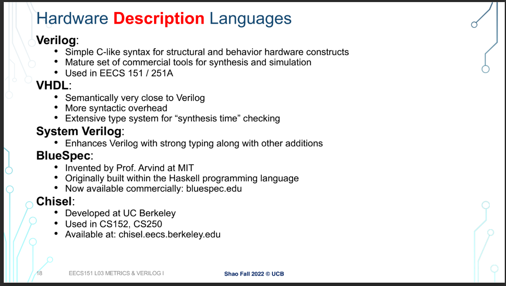
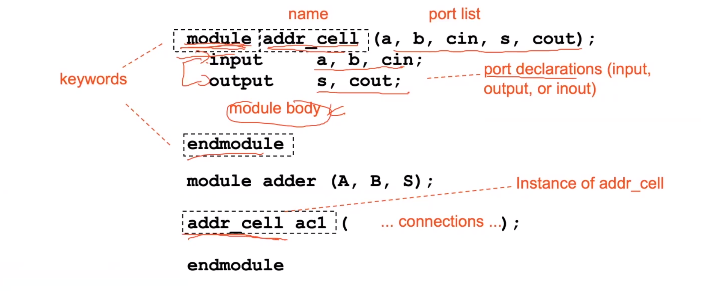
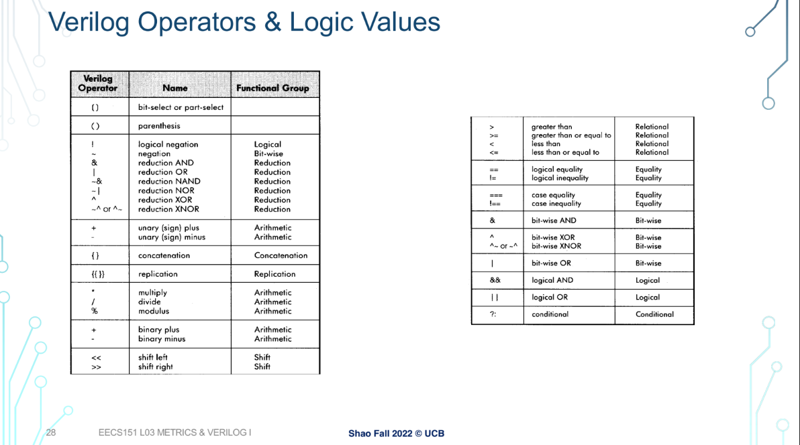
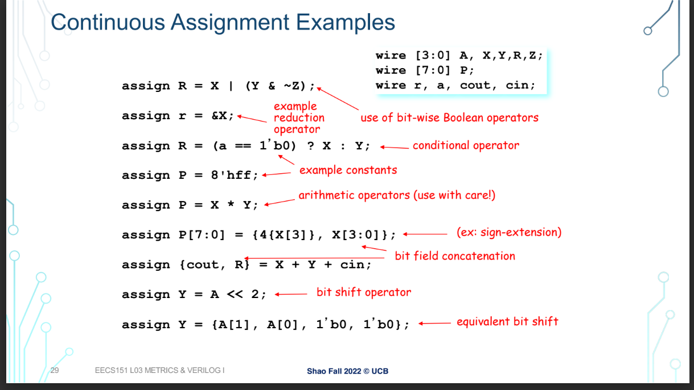
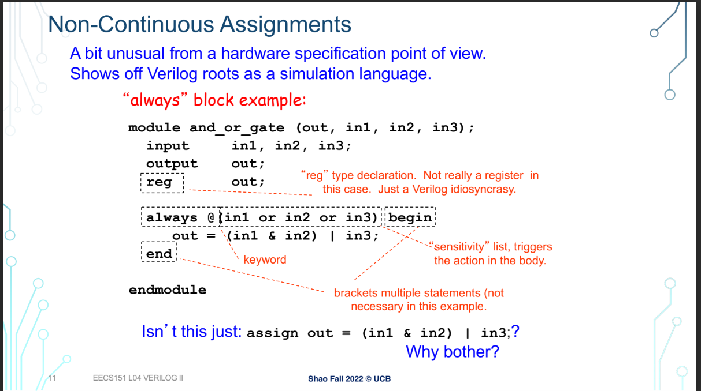
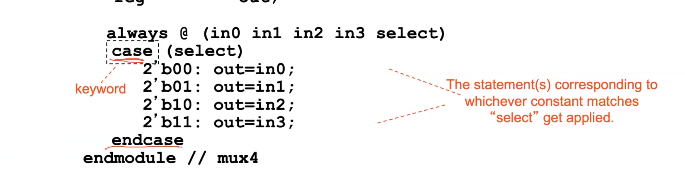
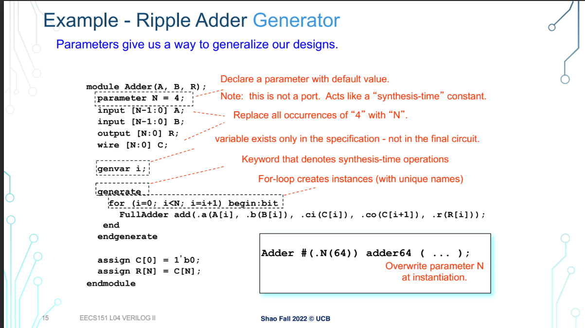
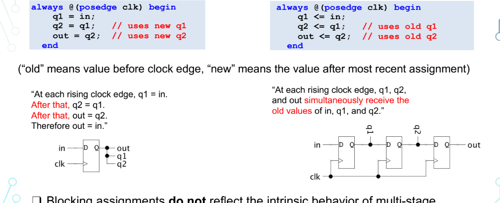
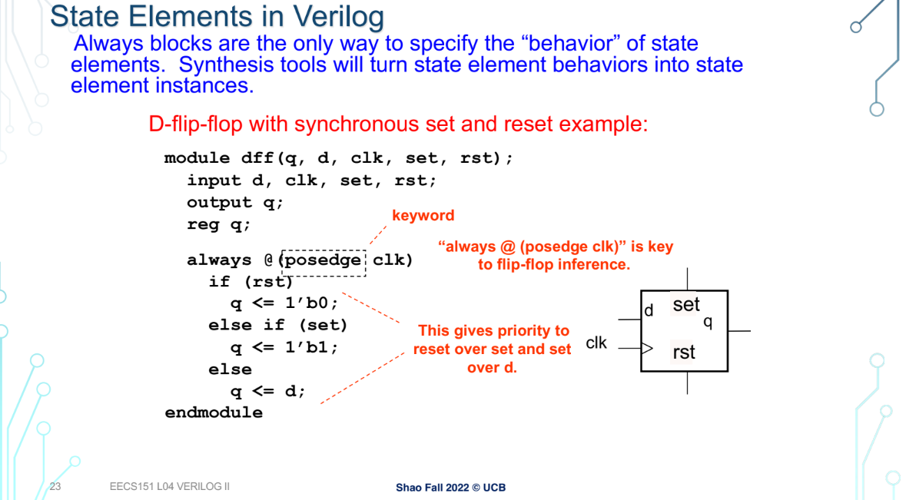

#### 概述 
 
- strcutual verilog 
• 就像原理图一样，但使用文本
• 编写繁琐，解码困难
• 您可以精确控制电路细节
• 可能需要映射到FPGA/ASIC 的特殊资源
- behavior verilog 
• 描述组件做什么，而不是如何做
• 综合成具有此行为的电路
• 结果取决于工具的好坏 

#### 思想 
分布解决
#### 关键字 
- module 
模块不是 C 意义上的函数。没有调用和返回
机制。可以将其视为分层数据结构。 

- named port （按名称实例化）
一种映射方法，用于低层级的形参和高层级的实参的映射 
.low——parameter（high_parameter）
- 简单行为及模型 
1. assign（连续赋值 ）
一些常用的操作符 
 
 
2. 非连续性赋值（always block with @）
注意，在always中的接收变量必须是reg类型，因为如果是时序电路，需要一个寄存器存储状态 
reg不只是寄存器，在组合逻辑电路中，可能只是一个wire 
敏感列表：就是说只要里边有一位改变，就会触发always
*带表任何条件都触发
作用：时序电路中的reset位 
posedge：上升沿 
 
- case（多路复用）（条件语句） 
case语句尽量做到穷尽，要不就得加上一个default情况
 
为什么不用if-else语句：嵌套的 if 结构导致“优先级逻辑”结构：
不同的输入有不同的延迟
（in3 到 out 延迟 > 比 in0 到 out 延迟）。
Case 版本将所有输入视为相同。 
总结：因为硬件电路可以实现物理上的并行化 
- gennerate （循环生成）
在gennerate中顾客使用for 循环 
 
- = （阻塞赋值）与<=（非阻塞赋值）
从begin的时候，先进性右边的计算，但是不赋值给右边，在end时再把所有的给右边赋值 

一个寄存器读写的例子 

