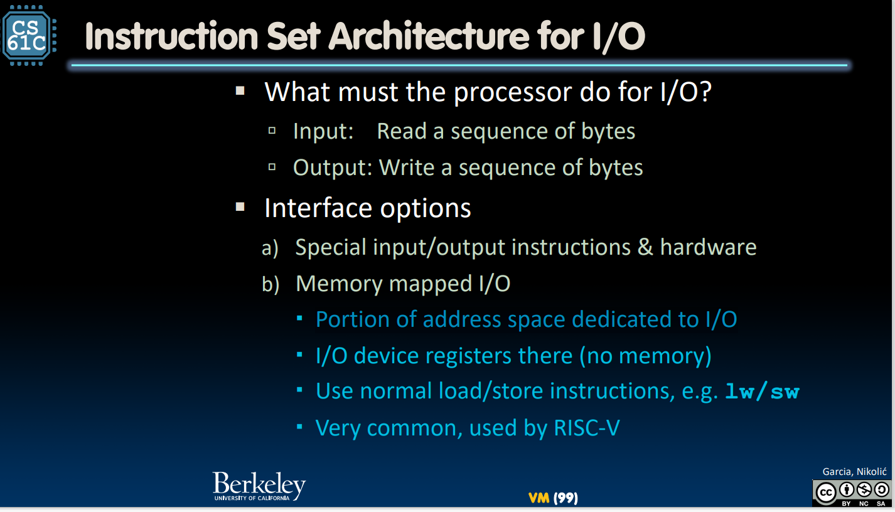
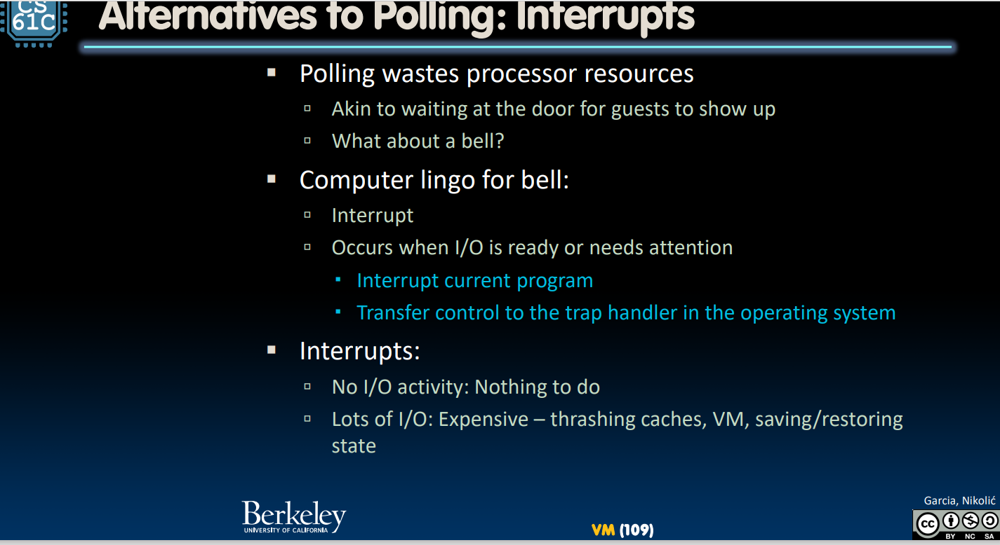
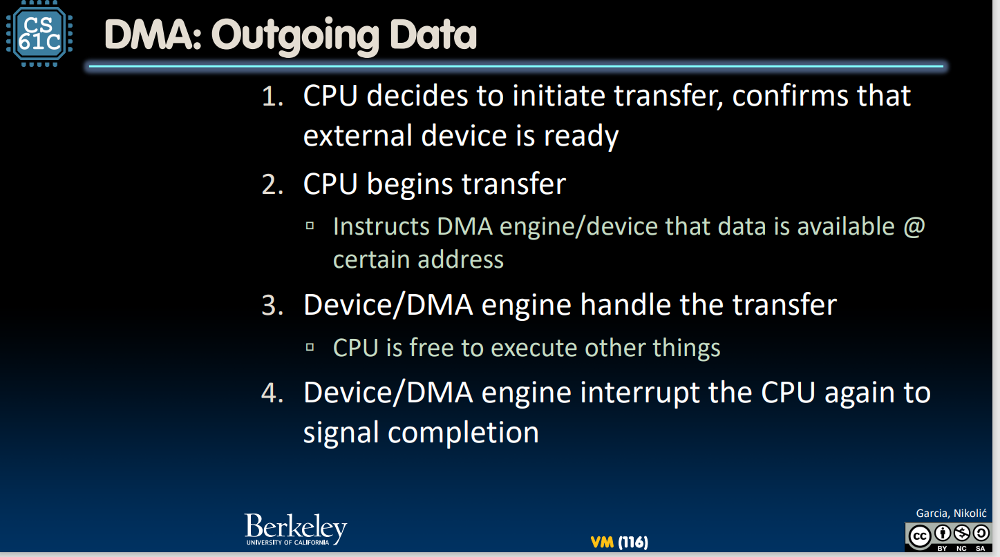
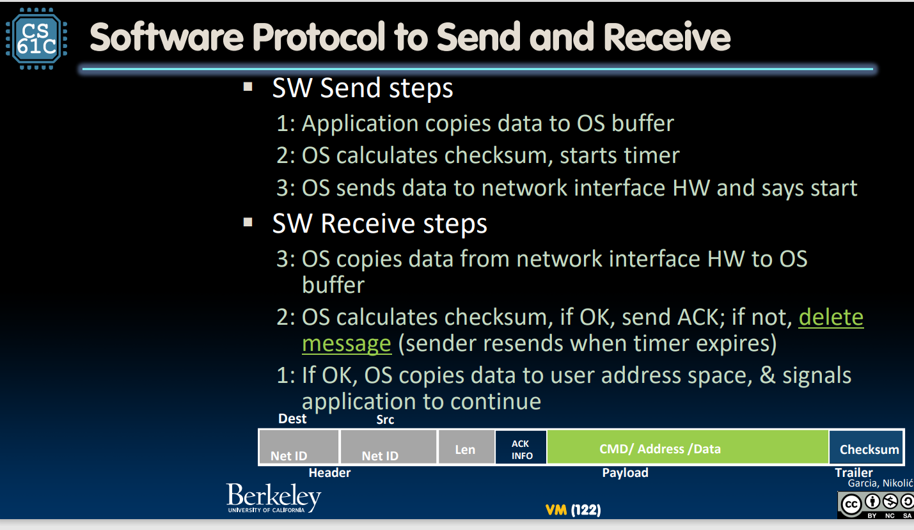

### io 
我们日常生活中的设备与CPU通信的种类是多种多样的
两种方式：
1. 用专用的指令 
2. 采取内存映射的方式（类似于将io设备中的寄存器放入低位adress中，cpu可以用lw sw指令操作） 
 
##### 轮询的硬件层面实现 （polling）
    1. 控制寄存器 和 数据寄存器 
    系统持续**循环**读入control register 
    等待设备准备好了后（0到1），指示“设备准备好接收”或“设备准备好写入了” 
    问题：这个方式太耗资源了 ，一个轮询过程大约花费400个clock，如果精度要求高，且设备频率高，对CPU的负载是极大的消耗 
##### 中断 （主要是依赖 trap handler）
 
##### DMA （direct memory access）
接收数据
1. Receive interrupt from device
2. CPU takes interrupt, initiates transfer 
3. Device/DMA engine handle the transfer（CPU is free to execute other things）
4. interrupt the CPU again 
发送数据

##### network 

