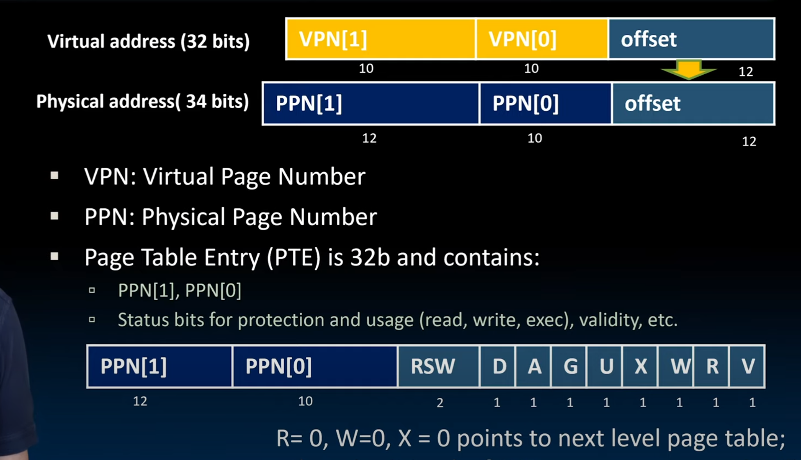

### 深入内存 
操作系统：让应用程序运行更简单，并且可以一次运行多个程序 
1. OS 在计算机运行时首先启动 
2. 查找并且控制所有的设备（依赖设备驱动） 
3. 启动服务（eg：文件系统，网络服务，TTY）
作用：对每个运行进程提供隔离环境 
提供交互给外界 
#### os与硬件的关系 

#### 启动时要做的事 
 
#### 启动应用 
应用一般被称为进程（process）
线程：共享内存 
process：分离进程 
线程和进程同时进行
syscall 
 
终端和异常的辨析 
 
 
这个和单核多程序的理解非常相近。
#### 虚拟内存 
下一个等级的内存结构：产生一种非常大的内存的错觉 
提供一种能力以便于运行一个比内存更大的程序 
从程序所说的地址到物理内存的转换  
virtual address：程序知道 
physical address：程序不知道 
举例：图书馆：book title virtual address 
book num：physical address 
书名只有一个，但是书可以有很多本，每个书的ime号也是独一无二的
作用：保护了多进程程序（因为让每个程序都可以取相同的地址，实际上是不导通的地址） 
- memory manager 
 多个程序使用内存时：
 1. 提供虚拟到实际的映射 
 2. 提供进程间保护 
 3. 交换内存到硬盘 
 ##### 交换内存到硬盘 
 简单使我们设计计算机系统的原则 
 paged memory （最小数据单位）4kB 
 12位来进行寻址 
 32位的地址空间为我们提供了100万个page 
 页表是啥？一个虚拟地址到实际地址的映射
 页表存在哪？mem 部分在加载时被存入cache 

  

1 pages = 4KB =32BLOCKS= 
1 block = 32 words
##### page fault
 
在此处，page table 对disk的写回策略是write back
size of table 
首先，page table 中的每一个元素都是page（4KB），因此对于32位的虚拟地址，我们需要12位来在page中寻址，剩下20位，就是每一个page的索引，而每一个地址32个bit 
 
很明显不对 
解决：将page table 分一个级，存在P1,P2（因为大多数程序用不了这么多的内存）
 
页表的元素格式 
 

##### 一种加速通过页表访问的方法 
TRANSLATION lookaside buffer （TLB） 
通俗来说，就是运用了LRB准则的结构，存入模式通常是full associative（此处的对应关系是page table与tlb的对应）就好像是page table 的缓存

 
我门应该先检查cache还是TLB？ tlb 
 
实际的使用流程就是这样 
 
VM-RELATED events in Machine 
 
 
上下文切换： 使能所有寄存器和缓存，来切换程序运行 

