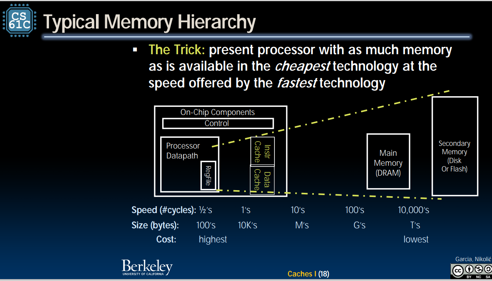

###CACHE 
#### cache 架构 
首先介绍了cache结构 
cache 是一种主存的缓存的副本 
1. cache与内存，寄存器的比较 
 
2. 设计思想 
 
3. 缓存的时间原则与空间原则 
 
#### direct-Mapped cache 
block = cache width = transfer widwth=1 byte 
cache location can be occipied by 0，4，8，12  
有几字节宽，就由log字节宽度告诉你找最低的几位 

**问题**：如何通过缓存中的内容判断它在内存中的那个位置？ 
solution：添加一个tag（占据1个字节），里面放缓存数（就是以一个缓存大小为单位，看看放入的缓存是第几个）
 
#### cache 术语 
cache  hit：缓存块是合法的并且包含需要访问的地址
cache miss：反义词 
cold：cache empty 
warming：cache filling with the values you'll hopefulkly be accessing again soon 
warm
hot:cache high percentage of hits 
因此，可以得到hit rate，miss rate，Miss penalty（time to replace a bloack from lower level in memory hierarchy to cache）
* valid bit:告诉别人缓存中的值是有用的还是没用的 
 

#### 访问顺序 

IVTO:index vailid Tag offest，这是查看比较的顺序 

- draw back 与draw through 

  就是说在持续更改一个地址上的变量时，是改一次就与内存同步一次，还是改完了在和内存同步。 

  如何改完再与内存同步呢？

**dirty bit**：一个信号指示位，如果为1，就说明缓存和内存的值并不相同 

#### blockszie和missrate与miss pennalty 的区别 

直观展示：

#### fully ssociated cache 

你会发现，如果采用ditrect map，就会出现相同位置（不同tag）的内容永远无法出现在cache中，因此，我门把index去掉，就可以避免 

问题：硬件电路设计复杂。 

#### 三个冲突

 
#### set ASSOCIATIVE CACHE 
类似于哈希表的逻辑，在每一个颜色的block中，多添加几行，每一个set中采取fuul associative 的策略 
 
- block replacement 
原则：
    1. LRU（least recent used）把最近最少使用的元素替换掉 
    2. FIFO 
    3. random 
    如果每一个set中只有两个block，就可以使用LRU 
性能评估：
 
多级缓存 
原因：随着CPU的频率提升，缓存和内存的取值速度差距太大了 
解决：多添加几级缓存 
 
一个递归的计算惩罚的公式