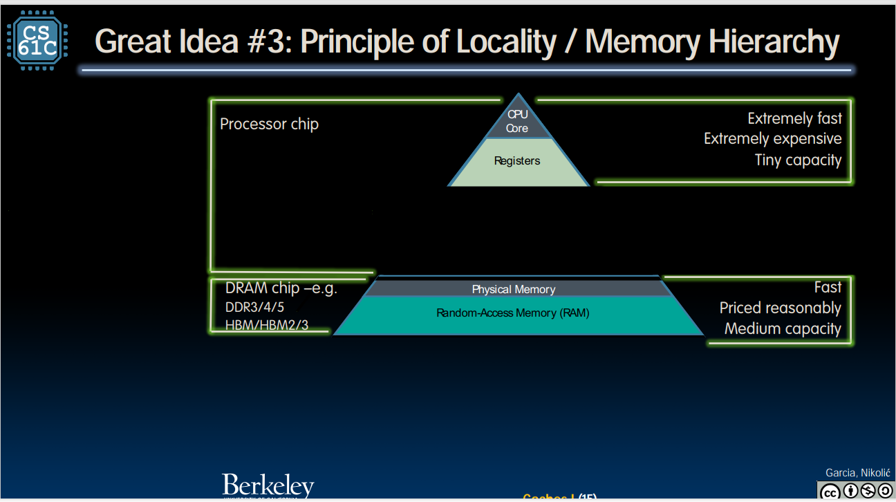
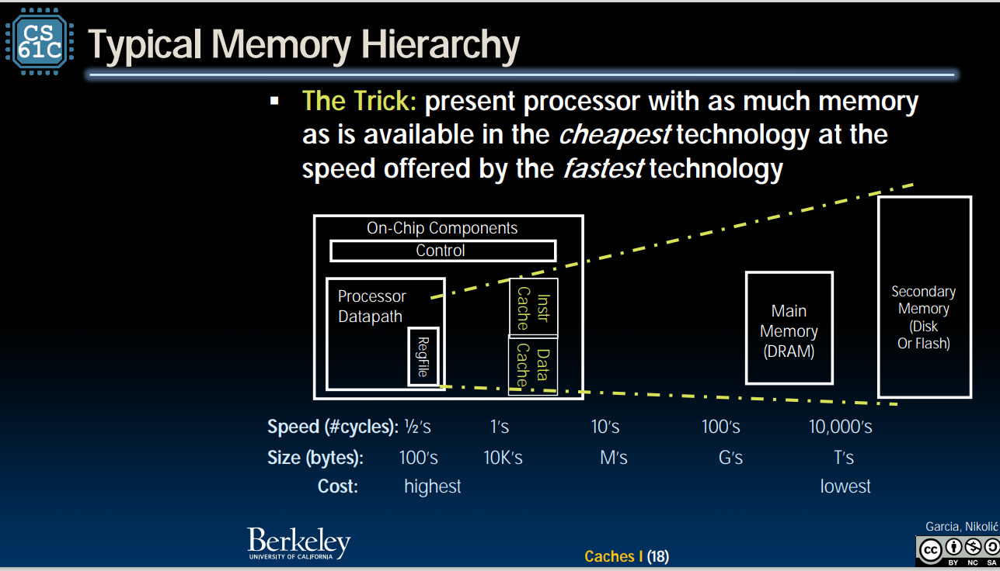

## intro 
- assembler 定义了机器能够识别的语言 
- **ISA（指令集）**定义了硬件可以执行的操作 
    不同的CPU执行不同的指令集。特定CPU实现的指令集是指令集架构 (ISA) 
    RISC-V的优势：越来越多的指令被加入指令集（like X86 MIPS ）
    每一条汇编代表一条机器指令 
    注意：汇编中没有变量 ，而是寄存器的概念 
     
    在32位的RISCv 中，每一个寄存器有32位，每一个寄存器称为一个word 
    register 是没有type的 
    #是汇编中的注释 
### 加法和减法
 
注意：要求很严格 
1的位置一定是操作符 
2是目的地
3，4都是源 
**所以**，一行c代码很有可能被分成一堆汇编语言 
addi：add immediately 除了最后一个参量变成真正的数，其他的区别都不大 
x0是硬件中的0，且值不会改变

### 内存指令  
1. 历史介绍
    - everything has a memory address 
    - 二进制兼容性（向后兼容性) 

2. 将指令看成数字 
    - 大多数数据在一个word中工作 
    
3. load data =read;store data = write 
    - word adress == the LSB byte adress (least significant ) 
    
4. code 
  lw (load word):**destination**    **offset define with bytes**(**base adress reg**) 

  sw(save word):**object reg**   **offset define with bytes**(**destination**) 

  lb(load byte ):自动导入到寄存器的低位

  sb(store byte ):same as lw /sw 

  - 符号扩展 

    所谓符号扩展，就是将数据的表示大小加倍，数值仍保持不变，即将符号位扩展到同样大小的寄存器空间中去，由两部分构成一个比原值表示大一倍的数。**正数必须要0扩展，负数必须用1扩展**。

    为什么要进行符号扩展呢？这是因为有些指令对操作数位数的要求，例如倍长于除数的被除数，再如将数据位数加长以减少计算过程中的误差 

  lbu：load byte with unsigned 

  sbu: (不用符号扩展)

### condition指令 

 - 条件指令 

     1. beq(branch equal) ：reg1 ,reg2 ,L1

     2. bne(branch not equal) :reg1,reg2,L1 

     3. bge(branch greater equal)

     4. bgeu(unsigned edition)

     5. blt(less than)

     6. bltu(unsigned edition from top)

        L1在此处指代的是标签 

- 非条件指令 
  1. j（jump）：**label** 

- 循环指令代码示例 

  ~~~ 汇编
  add x9, x8, x0 # x9=&A[0]
  add x10, x0, x0 # sum=0
  add x11, x0, x0 # i=0
  addi x13,x0, 20 # x13=2
  Loop:
  bge x11,x13,Done
  lw x12, 0(x9) # x12=A[i]
  add x10,x10,x12 # sum+=
  addi x9, x9,4 # &A[i+1]
  addi x11,x11,1 # i++
  j Loop
  Done: 
  ~~~

  等同于 ：

  ~~~C
  int A[20];
  int sum = 0;
  for (int i=0; i < 20; i++)
  sum += A[i]
  ~~~

### 逻辑指令 

both of them has register and immdiate version 

- 与运算

  and

  andi 

- 或运算 

  or 

  ori

- 异或 
- 右移
- 左移 
- Arithmetic shifting（算数移位）(算数右移考虑符号位，逻辑右移不考虑符号位)

  1. sra 

     

### 程序是如何运行的 

概述:从内存中取出指令，然后控制单元执行指令使用数据路径和内存系统，并更新 PC默认向 PC 添加 +4 字节，以移动到下一个顺序指令；分支，
跳跃改变

- 符号寄存器

a0-a7:参数寄存器 a0 a1 参数值 

s0 s1 是返回值

- 伪指令：“假”指令，因而不是可执行指令，不会产生机器代码，不会占用ROM空间，只用于汇编过程中为汇编程序提供汇编信息

mv ==复制

li = addi rd ,x0 ,13

nop = addi x0, x0 ,0

- 函数调用 

  汇编中函数的实现：很明显，我们需要用jump函数 

  jump函数的实际意义：其实就是将PC中的下一条指令的地址给改变

  结束时，新的指令：jr（jump to reg）

  jal（jump and link）

  x0：0 

  x1：返回值地址 

  x2：stack pointer

