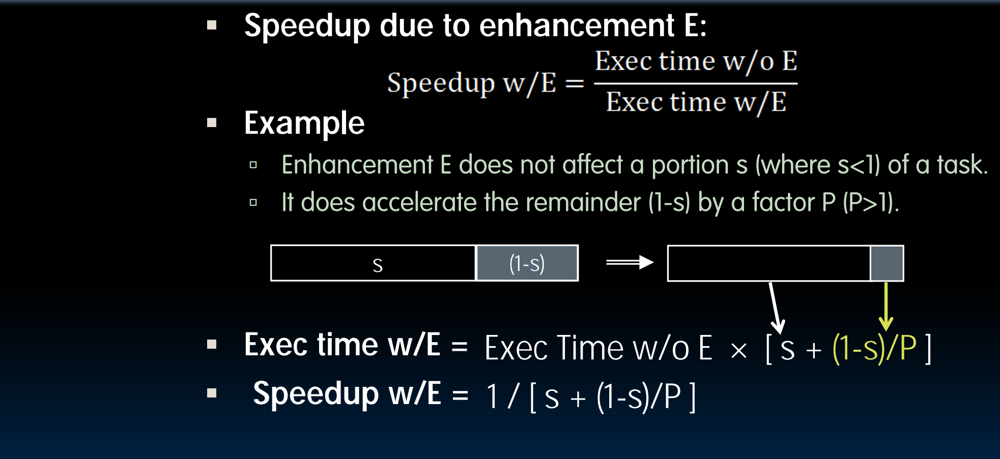

##### amdahl law 

 
##### 请求级别的并行化 
##### DLP 
两个种类：
1. 大量在内存中的数据可以并行操作  
2. 大量在硬盘的数据可以并行操作 
##### MAP reduce （开源项目：hadoop）
两个部分：map reduce 
##### spark（在内存中进行操作的开源项目）
##### dependibility via redundacy 
1. 空间冗余：冗余的硬盘或者内存中多分数据 
2. 时间冗余：重复提交多个数据 
名词： 
1. MTTF：MEAN TIME TO FAILURE 
2. SERvice interruption ： mean time to repair 
3. MBTF：mean time between failures =  MTTF+MTTR 
4. aVAILABILITYT = mttf/(MTTF+MTTR) 
5. afr:Annualiazes failure rate 
6. FIT:failure in time 
error detection 
1. 

