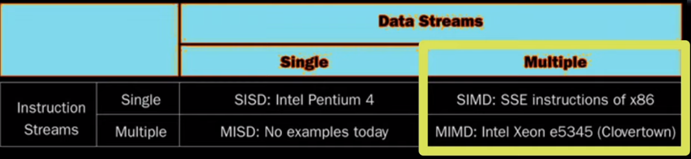
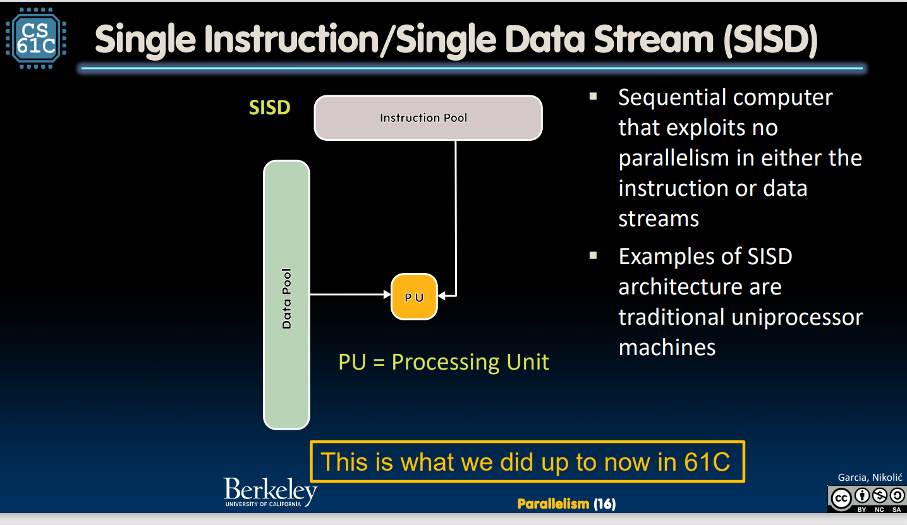
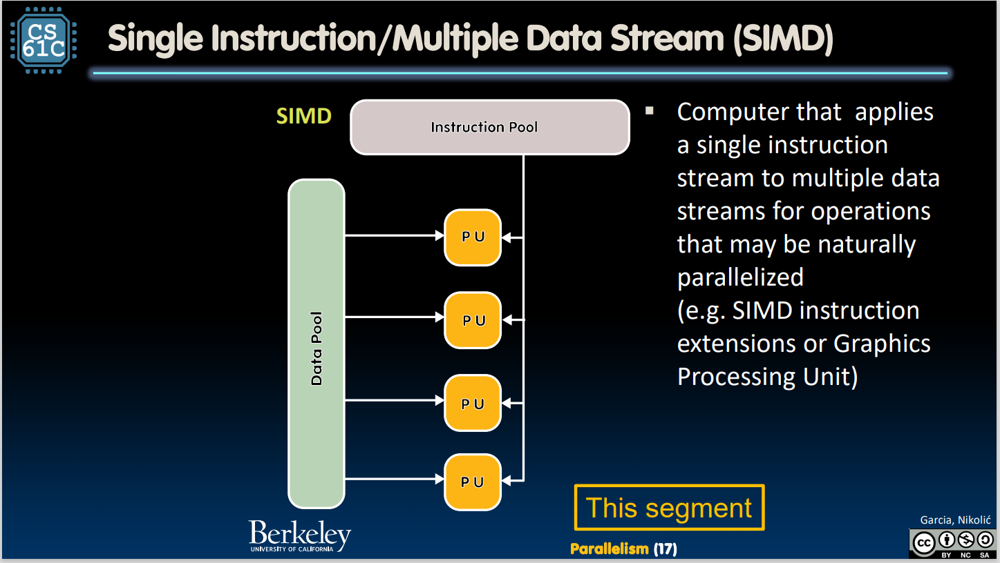
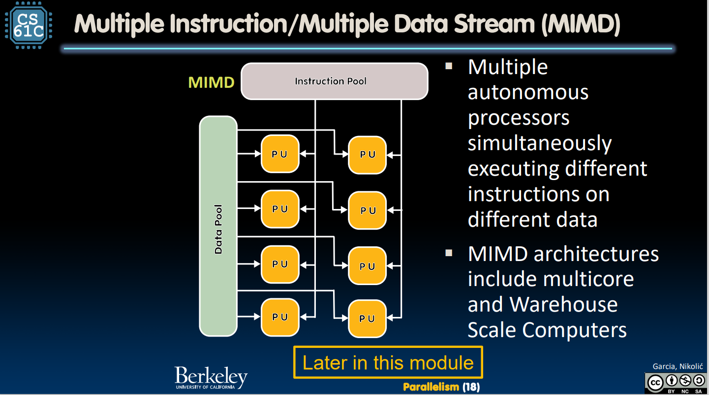
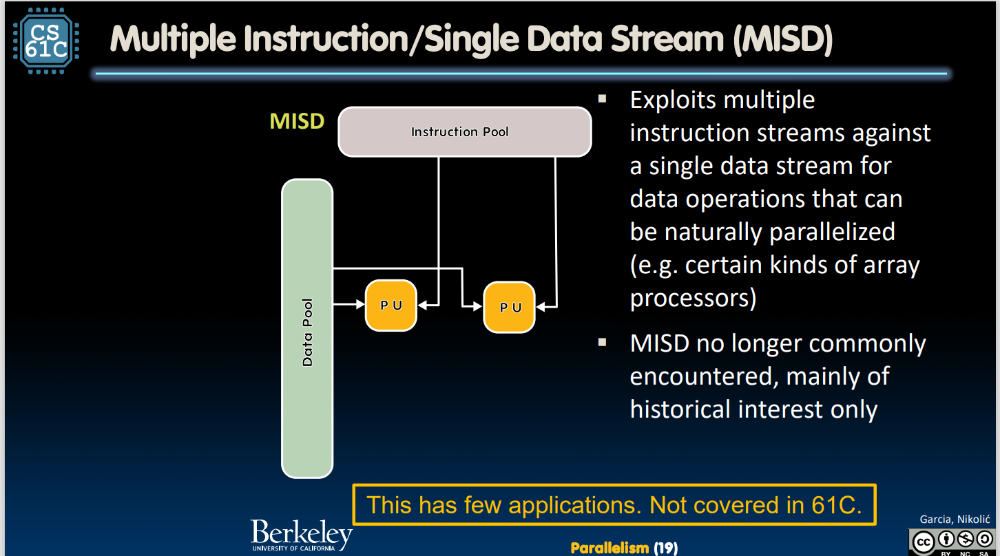
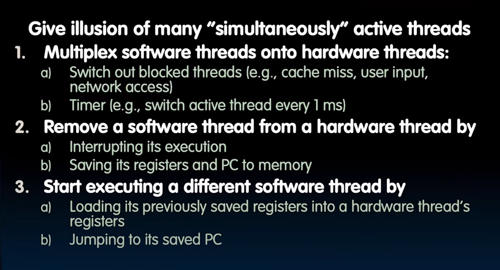
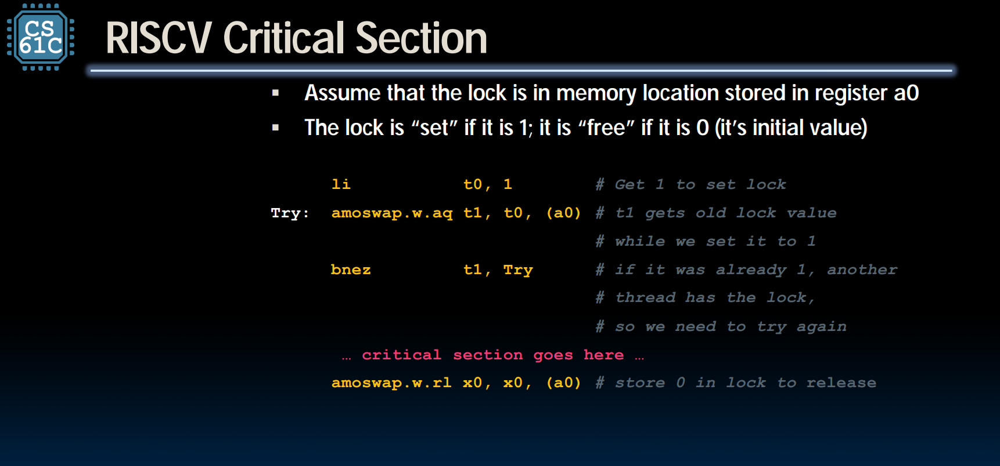
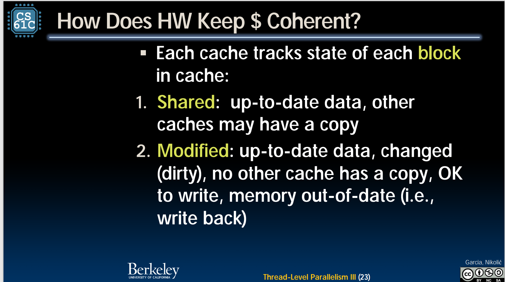
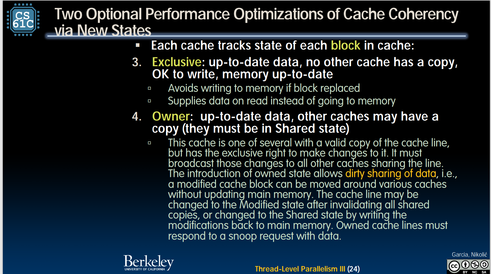
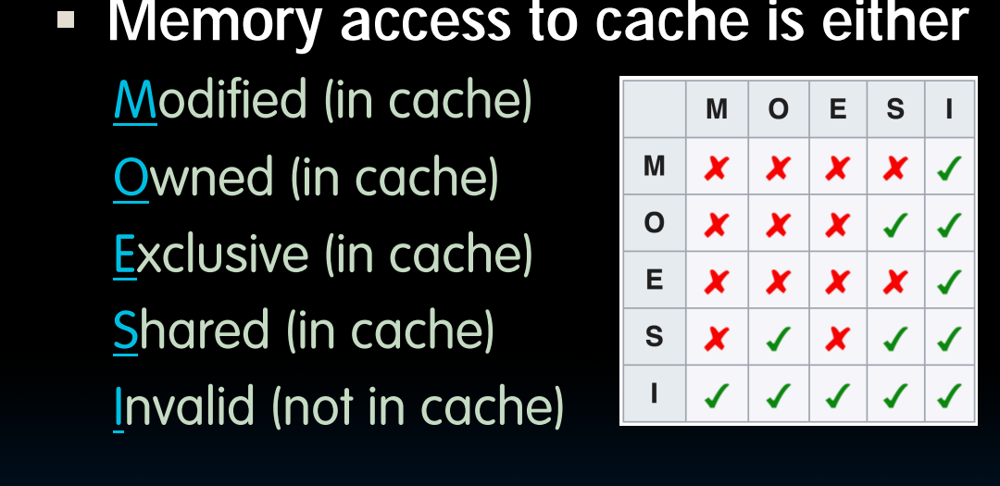

#### 矩阵乘法 

软件并行与硬件并行 

 
现在的大多数程序：单个程序和多个指令， 就是把数据流放在多个cpu上按条件执行（线程等级并行）
硬件单行 多数据流：专门的计算单元，用于处理 lock-step 计算（锁步操作）
##### 单指令单数据流
 
##### 单指令集多数据流 （矩阵乘法）
  
PU是一个core中的
MMX: multimedia extension
SSE:sreaming simd extension 
avx
##### 多数据流多指令集 
 
##### MISD
 
#### 并行计算机结构  
共享内存 
优点：简单的通信 方式 
缺点：很慢的内存，可能变成瓶颈 
改善：
#### threads 
线程：单个指令流（stands for thread of execution）
单核可以通过时分复用完成多线程 
每个线程：转悠程序计数器 
分离的寄存器 
访问共享内存 
hardware-thread：在核心上正在 运行的线程 
software-thread：一个程序可以被分成多个软件线程 
为什么一个程序要分成很多线程：如果分成100个，那么如果一个计算很长时间，99%都可以完成，但如果分的很少，（比如4个），那么有1/4都无法完成 
线程的开始，中断和结束（block thread 阻塞）
 
#####多线程（一个核心拥有多个线程）logic thread
问题：在切换线程时，必须使所有的寄存器状态保存，引入新的寄存器状态（从内存中），而且时间必须要短 
解决，引入两套datapath（intel call hyperthreads）但是ALU还是只有一个 
1%的硬件资源增加，10%的更好的性能 
##### openMP 
omp parallel
omp critical
获取时间 ：double omp_get_wtime(void)//获取单个线程的执行时间
竞争现象：在多线程中，每个线程都需要同一个资源，而且资源随进程执行而**改变**
同步：使用锁或者信号量来对特有资源进行锁定，如果资源被锁定，就自旋等待
    如何自旋？
    ```  
    while (lock != 0) ;
    ``` 
死锁：大家都在等待锁被打开，但没人开锁 
活锁：所有人调度时间一样，不调用的时间也一样
硬件级别的同步：
amoadd：3步操作 把旧址存在rd，加上rs2中的值 
 
共享内存和非共享的cache 
如果我们有cache读入一个值，而其他核又写入了一个值，那应该怎么处理呢？
cache的一致性：
为了解决这个问题，引入4个状态： 
 
 
四种状态的彼此关系，其中，行代表目标核，列代表除了目标核以外的其他核可以存在的状态 
